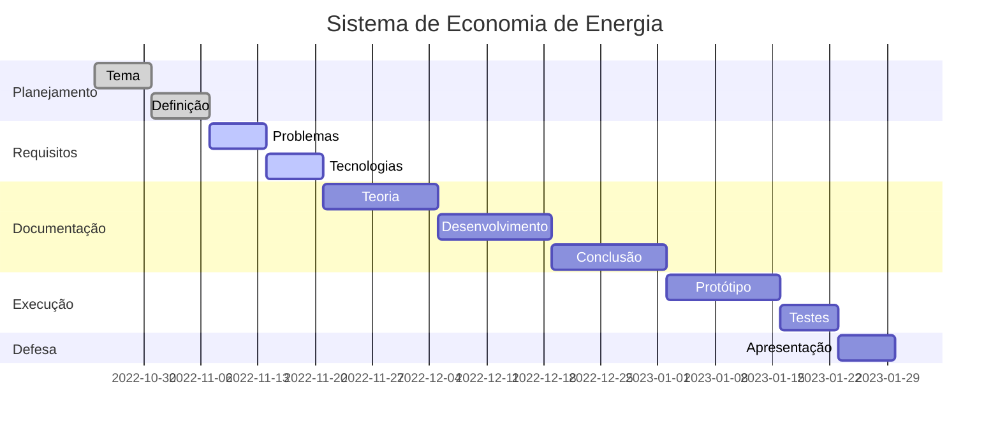
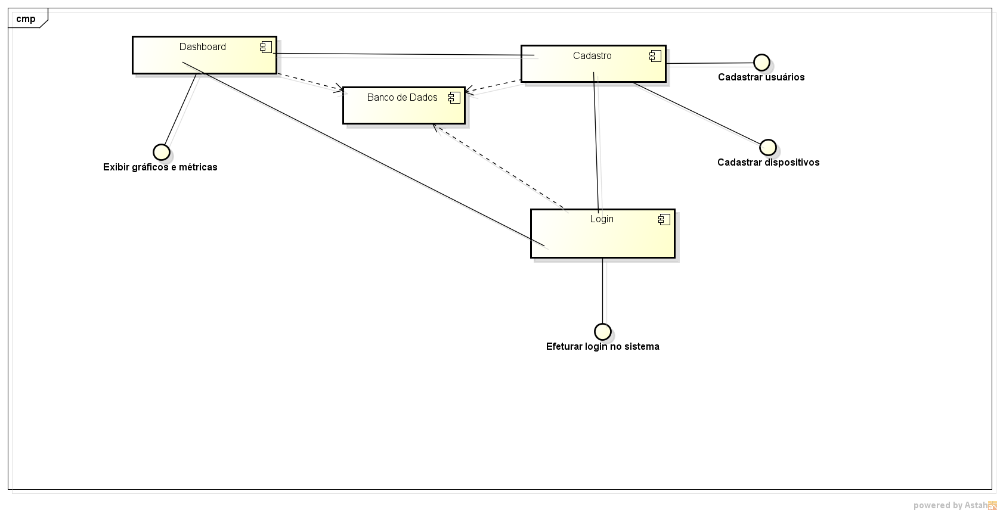

### Cronograma de atividades - gantt

* Projeto integrador I

### Diagrama de Componentes - Sistema de Economia de Energia

### Protótipo no Figma

### Telas

- Tela Inicial

- Login

- Cadastro de usuário

- Dashboard

- Listagem de usuários

- Listagem de dispositivos

