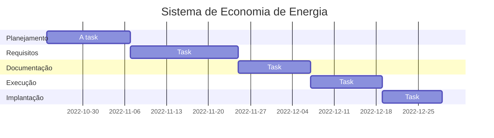

### Modelo de cronograma de atividades - gantt

* Conhecendo o mermaid: primeiros passos

```mermaid
gantt
    title Sistema de Economia de Energia
    dateFormat  YYYY-MM-DD

    section Planejamento
    A task           :a1, 2022-10-24, 14d

    section Requisitos
    Task             :b1, after a1  ,18d

    section Documentação
    Task             :c1, after b1, 12d

    section Execução
    Task             :d1, after c1, 12d

    section Implantação
    Task             :e1, after d1, 10d
```